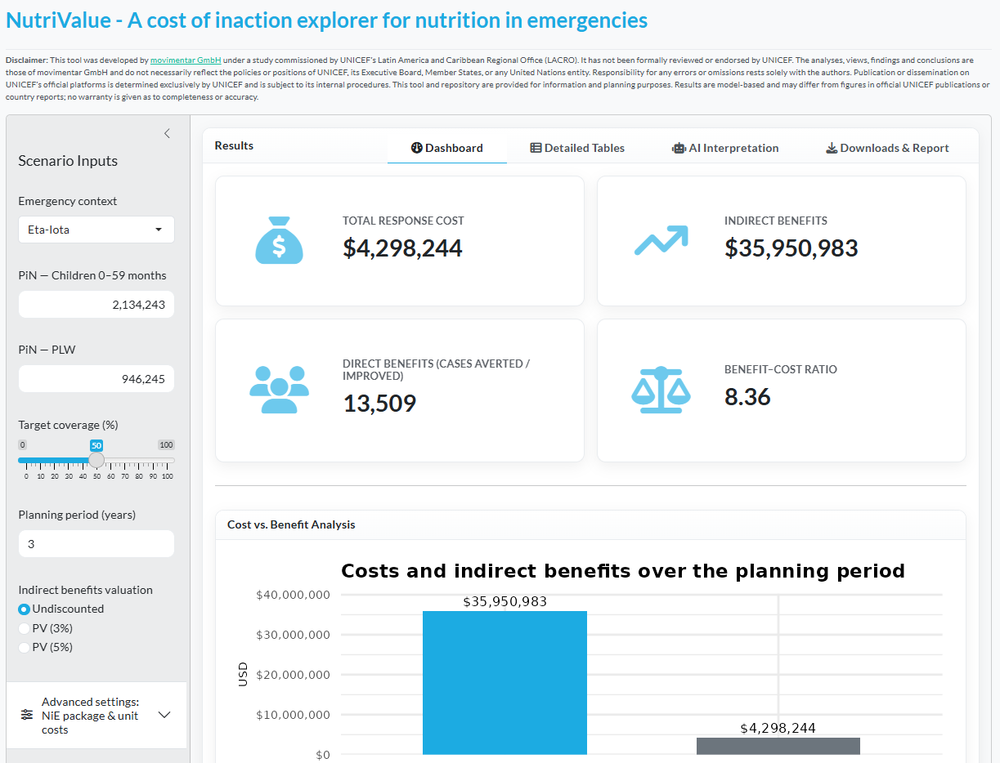

# The cost of inaction  (CoI) on nutrition in emergencies in Latin America and the Caribbean

This repository supports the study *“The Cost of Inaction on Nutrition in Emergencies in Latin America and the Caribbean (LAC)”*, implemented by **movimentar GmbH** in collaboration with **UNICEF** Latin America and Caribbean Regional Office (LACRO).

The LAC region faces a high risk of natural disasters, structural poverty, inequality, and widespread violence. These factors place vulnerable populations—particularly children under five and pregnant and lactating women (PLW)—at heightened risk of malnutrition, infectious disease, and long-term developmental challenges.

Migration flows, particularly from Venezuela and Central America, have added complexity to humanitarian needs. Despite the urgency, nutrition-specific interventions often receive limited funding in emergencies. This study quantifies the human and economic consequences of failing to adequately fund nutrition responses during selected emergencies in the region.

---
## Disclaimer

This repository has not been officially endorsed by UNICEF. The views, opinions, findings, and conclusions expressed in this repository and its files are those of movimentar GmbH and do not necessarily reflect the official policies or positions of UNICEF, its member states, or other affiliated United Nations agencies. The responsibility for the views and interpretations presented rests solely with movimentar GmbH.

Any publication or dissemination on UNICEF's official platforms is managed directly by UNICEF, in accordance with its institutional procedures. This repository is being shared by movimentar GmbH to promote auditing of findings, public access to the research and facilitate its use by UNICEF staff, other partners and researchers.

---

## What is in this repository

```
unicef-lac-coi-nutrition/
├─ _targets.R                 # Reproducible pipeline (targets)
├─ _targets/                  # local targets store (ignored by git)
├─ raw_data/                  # input data
├─ R/                         # project functions
├─ coi_app/                   # Shiny app (self-contained)
│  ├─ app.R
│  ├─ report.Rmd
│  ├─ data/                   # .rds inputs for app runtime
│  └─ www/                    # styles.css, images, script.js
├─ col_results.qmd            # reporting/analysis (Quarto)
├─ figures/, images/          # logos, plots and diagrams
├─ Col_results_summary.xlsx   # exported tables
├─ scientific_manuscript.qmd  # manuscript source
└─ README.md
```

## What is not tracked by Git

> **Note on Git:** Several outputs and local artifacts are intentionally **not** tracked (see `.gitignore`). Notably: the `_targets/` store, Word/HTML renders, the `rsconnect/` folder, `.Rhistory`, and large report exports.

From `.gitignore` (abridged):

* R history/session files, `.Rproj.user/`, `*.Rproj`
* `_targets/` store and temporary caches
* `docs/`, `rsconnect/`, `temp/`
* Large renders: `*.docx`, HTML report variants
* Secrets: `.Renviron`, `.httr-oauth`

This keeps the repo lean and deployment-safe.

---

## What the app does

The web application Cost of Inaction Explorer - Nutrition in Emergencies is available at [https://movimentar.shinyapps.io/nutrivalue/](https://movimentar.shinyapps.io/nutrivalue/).

<div align="center">
  <a href="https://movimentar.shinyapps.io/nutrivalue/" target="_blank">
    
  </a>
</div>

* **Inputs**

  * Emergency context (Eta–Iota / Migration flows)
  * PiN for **children 0–59m** and **PLW**

    * **Defaults** are taken from the study’s *Interventions needed* totals (Table 3) per emergency:

      * Eta–Iota: Children **2,134,243**, PLW **946,245**
      * Migration flows: Children **4,850,943**, PLW **2,026,811**
    * You can adjust PiN in the sidebar at any time.
  * Target coverage (%), planning period (years)
  * Valuation of indirect benefits: **Undiscounted**, **PV (3%)**, **PV (5%)** (PV requires the optional `gni_forecast` + `income_share` `.rds` files)
  * Package composition (tick/untick interventions) + per-intervention **unit-cost overrides**

* **How results are computed**

  * **Coverage interpolation:** piece-wise linear between 0 → 30 → 95%.
  * **PiN scaling:** children/PLW indicators scale by the user PiN relative to baseline.
  * **Costs:** proportional to coverage and PiN; by default use **median per-person costs** from the study unless overridden.
  * **Indirect benefits:** breastfeeding-linked benefits plus avoided formula costs; PV options discount future earnings (if the optional data is present).

* **Outputs**

  * Four **value boxes** (Total cost, Indirect benefits, Direct benefits total, BCR)
  * **Cost vs. benefit** bar chart
  * **Planning summary** table (clean labels)
  * **Direct benefits by indicator** (grouped table)
  * **Printable HTML report** (`report.Rmd`) with the same KPIs/tables and an optional **AI narrative**
  * **Downloads:** XLSX summary and full indicator table

---

## Methodological framework

The analysis applies the **Cost of Inaction (CoI)** framework developed by [Anand, S., Desmond, C., Fuje, H., & Marques, N. (2012). The cost of inaction: Case studies from Rwanda and Angola. Harvard University Press.](https://www.hup.harvard.edu/books/9780674065581) The study estimates both **direct benefits** (e.g. lives saved, morbidity avoided) and **indirect benefits** (e.g. cognitive gains, economic productivity) that would be realised through full implementation of nutrition-specific interventions.

Key methodological tools and assumptions include:

* **Lives Saved Tool (LiST)**: Used to estimate changes in mortality and health outcomes.
* **Cost of Not Breastfeeding Tool**: Used to estimate indirect economic benefits of exclusive breastfeeding.
* **Median costing**: Due to gaps in intervention-level cost reporting, we applied medians across countries for each intervention.
* **Proxy baselines for migrants**: Due to data limitations, national Venezuelan baseline indicators were used to model migrant populations.

---

## Reproducible analysis pipeline

This repository is built using the [`targets`](https://books.ropenspec.org/targets/) R package to ensure a structured, reproducible data pipeline. This system allows researchers to rerun, trace, and validate each step of the analysis.

The **`targets`** pipeline ensures that all analysis steps are transparent, reproducible, and modular. It automatically updates only what needs to be re-run when data or code changes, saving time and reducing error.

  * Think of each step as a building block. A *target* is a named object like a table or result.
  * The final results in the Word and Excel files are built from the target `coi_df`, which combines all calculations.
  * You can explore or edit results using `tar_load()` without manually running every step again.

### The Data Pipeline Visualised

The following diagram illustrates the flow of data from raw sources to final report outputs. This visual provides a high-level overview of the entire analytical process, showing how raw data is cleaned, modelled, and aggregated to produce key findings and tables. The purple block highlights the **modelling stage**, which uses the Lives Saved Tool (LiST).


<div align="center">   
 
</div>

### System requirements

* **R version**: 4.2.3 (2023-03-15 ucrt)
* **Primary script**: `_targets.R`
* **Main output**: `coi_df` — a data frame with intervention coverage and cost estimates

### Required packages

All required packages are listed in `tar_option_set()` in `_targets.R`. One package must be installed manually:

```r
remotes::install_github("PPgp/wpp2022")
```

-----

## How to run the analysis

### 1\. Load the project

Open the R Project file `unicef-lac-coi-nutrition.Rproj` in RStudio. This sets the working directory and environment.


### 2\. Visualise the pipeline (optional)

To explore the structure of the analysis visually:

```r
targets::tar_visnetwork()
```

To zoom in on the output path for the main dataset (`coi_df`):

```r
targets::tar_visnetwork(names = "coi_df")
```

This diagram can be useful for explaining the workflow or reviewing dependencies between processing steps. It is not required to run the pipeline.

### 3\. Run the full workflow

This executes all data loading, wrangling, aggregation, and result generation:

```r
targets::tar_make()
```

### 4\. Access outputs

To retrieve a result into your environment (e.g. the main data frame):

```r
targets::tar_load("coi_df")
```

Other intermediate objects are defined as targets and can be loaded similarly. These include cleaned data sets, cost tables, mortality estimates, and more.

-----

## How to run the app (CoI Explorer)

**Folder:** `coi_app/`
**Run locally:**

```r
setwd("coi_app")
shiny::runApp()
```
To keep ShinyApps deployments lightweight and avoid relying on a `_targets` store on the server, the app loads from **`coi_app/data/*.rds`**. After a successful `tar_make()`, create these files once:

```r
# From the project root, after tar_make()
saveRDS(targets::tar_read_raw("intervention_list"),    "coi_app/data/intervention_list.rds")
saveRDS(targets::tar_read_raw("coi_costs"),            "coi_app/data/coi_costs.rds")
saveRDS(targets::tar_read_raw("coverage_costs"),       "coi_app/data/coverage_costs.rds")
saveRDS(targets::tar_read_raw("median_costs_cleaned"), "coi_app/data/median_costs_cleaned.rds")
saveRDS(targets::tar_read_raw("coi_dir_benefits"),     "coi_app/data/coi_dir_benefits.rds")
saveRDS(targets::tar_read_raw("coi_indir_benefits"),   "coi_app/data/coi_indir_benefits.rds")
# Optional (for PV valuation in the app):
# saveRDS(targets::tar_read_raw("gni_forecast"), "coi_app/data/gni_forecast.rds")
# saveRDS(targets::tar_read_raw("income_share"), "coi_app/data/income_share.rds")
```

> If these `.rds` files are missing, the deployed app will fail with
> **“Targets store `_targets` missing.”**
> The app deliberately falls back to `.rds` to be deployment-safe.

## The printable report

`coi_app/report.Rmd` generates a single-file HTML report with:

* Executive KPIs and a cost-vs-benefit chart
* Scenario inputs and key results (cleaned labels)
* Direct benefits (top indicators, by category, full table)
* **Optional AI narrative** (if `GEMINI_API_KEY` is set)

-----

### Raw data files

All data used in the analysis is stored in the `raw_data/` folder. Key files include:

  * `co_cost_beneficiary_data.csv`: Reported beneficiaries and intervention costs
  * `pin_data.csv`: People in Need (PiN) estimates
  * `emergency_list.csv`: Metadata on studied emergencies
  * `intervention_list.csv`: Descriptions of all modelled interventions
  * `formula_price.csv`: Unit cost of infant formula
  * `mean_earnings.csv`: National income data for economic modelling
  * `income_share.csv`, `gni_forecast.csv`: Data for productivity loss estimates
  * `list_indicator_metadata.csv`, `list_output.csv`: LiST-generated mortality and morbidity outputs
  * `funding_data_2.csv`: Humanitarian nutrition funding data (reported vs. needed)

These inputs are read and validated during pipeline execution. Any changes to the data must be reflected by re-running `targets::tar_make()`.

-----

## Report outputs

After running the pipeline, report outputs can be found in:

  * `col_results.qmd`: Source code for tables and summaries
  * `col_results.docx`, `col_results.html`, `Col_results_summary.xlsx`: Exported result files

-----

## Methods (very short)

* **Framework:** The analysis adapts the **Cost of Inaction (CoI)** framework developed by [Anand, S., Desmond, C., Fuje, H., & Marques, N. (2012). The cost of inaction: Case studies from Rwanda and Angola. Harvard University Press.](https://www.hup.harvard.edu/books/9780674065581) 
* **Direct benefits:** primarily LiST outputs and breastfeeding indicators
* **Indirect benefits:** avoided formula costs during 0–24 months; lifetime earnings uplift from breastfeeding
* **Coverage curve:** linear interpolation 0→30→95%
* **Costs:** median per-beneficiary unit costs × delivered at target coverage × PiN scaling
* **PV:** discounting of future earnings (3%/5%) when optional macro data is present

-----

## Acknowledgements

This study was made possible through the dedicated efforts of many individuals and organizations. The analysis was commissioned by UNICEF LACRO and implemented by movimentar GmbH.

**UNICEF Latin America and Caribbean Regional Office (LACRO)**:

-   **Primary Guidance & Support:** Yvette Fautsch and Paula Veliz.

-   **Wider Team Collaboration:** Delhi Trejo, Edgar Gonzalez, Leon Cases Gonzalez, Maaike Arts, Matthias Sachse, and Veronica Risso.

-   We also extend our sincere thanks to the **UNICEF Country Office teams** whose data and collaboration were the foundation of this analysis.

**External Expertise**:

-   **Sona Sharma (Action Against Hunger):** For providing invaluable insights on operational realities.

**Implementation Team (movimentar GmbH)**:

-   **Project Lead & Senior Consultant:** Dr. rer. pol. Eduardo Wirthmann Ferreira

-   **Lead Technical Implementation & R Programming:** Saul Gámez

-   **Technical Support & Expert Insights:** Alejandra Toledo

-   **Project Management & Quality Control:** Annalena Oeffner Ferreira

-   **With support from:** Camila Campillo, Carolina Clemens, and Luisa Martins.

## Contact & Repository

-   **Questions, issues, or contributions:** [support@movimentar.eu](mailto:support@movimentar.eu)
-   **Repository:** [https://github.com/movimentar/unicef-lac-coi-nutrition](https://github.com/movimentar/unicef-lac-coi-nutrition)
